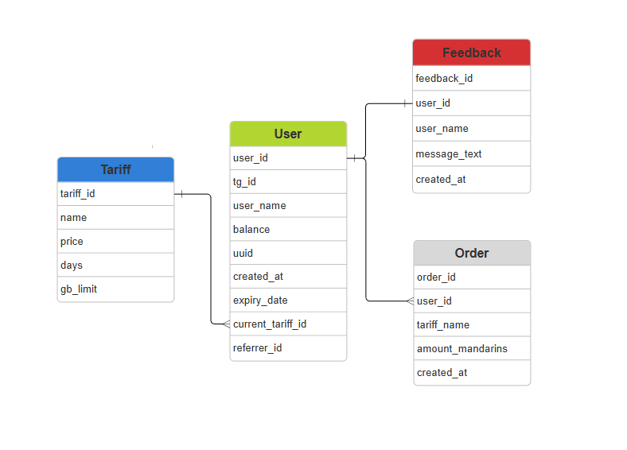

# VPN Сервис в Telegram Bot

---

[](https://www.python.org/downloads/release/python-3100/) 
[](https://pypi.org/project/aiogram/3.24.0/)
[](https://pypi.org/project/SQLAlchemy/2.0.45/)
[](https://pypi.org/project/py3xui/0.5.5/)

---

## Настройка проекта перед запуском
### Создание и активация виртуального окружения

## Windows
```shell
  python -m venv .venv
```

```shell
  .venv/Scripts/activate
```

## Linux
```shell
  python3 -m venv .venv
```

```shell
  source .venv/bin/activate
```

---

## Запуск Бота

### Перед запуском 
### 📝 Заполните файл `.env.list` в корневой папке проекта и измените его на `.env`

---
## ⚡ Запустите файл `main.py` ⚡
### <i>❗ У вас начнется автоматическая установка и обновление пакетов для успечной работы VPN сервиса.<br>❗ Не останавливайте этот процесс, после успешной установки вам в терминал будет выведено сообщение о запуске бота.</i>
</br>* <i><b>`Windows`</b></i> *
```shell
  python main.py
```

</br>* <i><b>`Linux`</b></i> *
```shell
  python3 main.py
```

---

## Структура Базы Данных (DB)



---

[✨ Developer 2024 🎉](https://github.com/Zagidin)